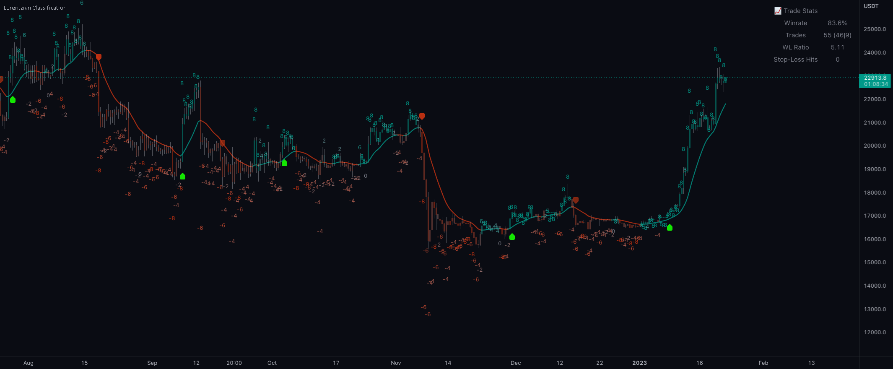

<div align="center">

<h1>Lorentzian Classification</h1>

<p>
  <strong>The <a href="https://www.tradingview.com/script/WhBzgfDu-Machine-Learning-Lorentzian-Classification/">Lorentzian Classification</a> indicator by <a href="https://www.tradingview.com/u/jdehorty/">Justin Dehorty</a>,<br>ported to Python, Rust, Lean 4, and MQL5.</strong>
</p>

<!-- tradingview-badges:start -->
<p>
  <a href="https://www.tradingview.com/script/WhBzgfDu-Machine-Learning-Lorentzian-Classification/"></a>
</p>
<p>
  <a href="https://www.tradingview.com/chart/BTCUSD/LYCOEW6Z-TradingView-Community-Awards-2023/"></a>
</p>
<p>
  <a href="https://www.tradingview.com/script/WhBzgfDu-Machine-Learning-Lorentzian-Classification/"></a>
  <a href="https://www.tradingview.com/script/WhBzgfDu-Machine-Learning-Lorentzian-Classification/"></a>
  <a href="https://www.tradingview.com/script/WhBzgfDu-Machine-Learning-Lorentzian-Classification/"></a>
</p>
<!-- tradingview-badges:end -->

<p>
  <a href="ports/pinescript/"></a>
  <a href="ports/python/"></a>
  <a href="ports/rust/"></a>
  <a href="ports/lean/"></a>
  <a href="ports/mql5/"></a>
</p>

<p>
  <em>Don't see the language you're looking for? Request a new port <a href="https://github.com/artificial-intelligence-edge/lorentzian-classification/issues/new?template=port-request.yml">here</a>.</em>
  <br><br>
  <a href="https://ai-edge.io"></a><br>
  <sup>Maintained by <a href="https://ai-edge.io">AI Edge</a>.</sup>
</p>

</div>

[](https://www.tradingview.com/script/WhBzgfDu-Machine-Learning-Lorentzian-Classification/)

<p align="center"><em><a href="https://www.tradingview.com/script/WhBzgfDu-Machine-Learning-Lorentzian-Classification/">View live on TradingView →</a></em></p>

## Overview

Lorentzian Classification is an open-source TradingView indicator: a
**nearest-neighbor-based classifier** (it labels the current bar by looking at
the historical bars it most resembles) that uses **Lorentzian distance** as the
measure of resemblance to model price movement. It is a classifier, not deep
learning and not an autonomous trading agent.

- **Want to use it on a chart?** Add the original indicator on TradingView:
  [Machine Learning: Lorentzian Classification](https://www.tradingview.com/script/WhBzgfDu-Machine-Learning-Lorentzian-Classification/).
- **Want to use it on MetaTrader 5?** Start with the
  [`ports/mql5/`](ports/mql5/) indicator and Expert Advisor.
- **Want to build on it locally?** Choose the Python, Rust, or Lean 4 port
  below depending on whether you need scripting ergonomics, compiled speed, or
  a formal executable specification.

A *port* is a reimplementation of a program in a different programming language
or for a different platform. The Python, Rust, Lean 4, and MQL5 ports under
[`ports/`](ports/) reproduce the original PineScript indicator's algorithm,
alongside the pinned PineScript source this repo keeps for review and parity
testing.

## Choose a port

| Port | Best for | Start here |
| --- | --- | --- |
| PineScript v6 | TradingView users who want the original chart indicator | [Open on TradingView](https://www.tradingview.com/script/WhBzgfDu-Machine-Learning-Lorentzian-Classification/) |
| MQL5 | MetaTrader 5 users who want the indicator plus a Strategy Tester EA | [`ports/mql5/`](ports/mql5/) |
| Python | Research workflows, CSV exports, notebooks, and the quickest local smoke test | [`ports/python/`](ports/python/) |
| Rust | Fast local testing, dependency-light library usage, and performance-focused experiments | [`ports/rust/`](ports/rust/) |
| Lean 4 | An executable formal specification with stated and tested invariants | [`ports/lean/`](ports/lean/) |

Need another ecosystem? [Request a new port](https://github.com/artificial-intelligence-edge/lorentzian-classification/issues/new?template=port-request.yml).

## Fastest local smoke test

No accounts, API keys, or external data needed. This runs on a Coinbase
BTC/USD daily history committed to the repo and needs only Python 3. It is the
shortest way to verify the algorithm locally, not the only supported port. From
the repository root, compute the full result series:

```bash
PYTHONPATH=ports/python python3 -m lorentzian_classification run \
  tests/parity/baselines/pine_coinbase_btcusd_1d_limited_history.csv \
  --output /tmp/btcusd_daily_signals.csv
```

View the most recent signals:

```bash
column -s, -t < /tmp/btcusd_daily_signals.csv | tail -5
```

For Rust, Lean 4, cross-port parity, and bring-your-own TradingView CSV
workflows, see [`docs/examples.md`](docs/examples.md).

## Quick links

| Need | Link |
| --- | --- |
| Use the original indicator | [TradingView Editors' Picks](https://www.tradingview.com/script/WhBzgfDu-Machine-Learning-Lorentzian-Classification/) |
| Use the MetaTrader 5 port | [`ports/mql5/`](ports/mql5/) |
| Read the settings reference | [ai-edge.io/docs](https://ai-edge.io/docs/indicators/lorentzian-classification/general-settings) |
| Explore optimizer studies | [AI Edge Optimizer](https://optimizer.ai-edge.io/studies) |
| Reproduce validation | [`docs/validation.md`](docs/validation.md) |
| Run the examples | [`docs/examples.md`](docs/examples.md) |
| Request another port | [New port request](https://github.com/artificial-intelligence-edge/lorentzian-classification/issues/new?template=port-request.yml) |

## What is in this repo

| Path | What it is |
| --- | --- |
| [`ports/pinescript/`](ports/pinescript/) | The SHA-pinned original TradingView indicator that everything else is checked against |
| [`ports/python/`](ports/python/) | Python CLI and library port; reproduces the gold baselines (the TradingView CSV exports we treat as ground truth) with exact signals and feature/kernel tolerance |
| [`ports/rust/`](ports/rust/) | Rust core library and CLI; bit-exact with the Python port |
| [`ports/lean/`](ports/lean/) | Lean 4 executable formal specification with proved structural invariants; byte-identical output to the Rust port |
| [`ports/mql5/`](ports/mql5/) | MetaTrader 5 indicator and Expert Advisor wrapper |
| [`docs/`](docs/) | Validation policy and copy-pasteable cross-port usage examples ([`docs/examples.md`](docs/examples.md)) |
| [`tests/`](tests/) | Parity fixtures, gold baselines, and the cross-port parity harness (`tests/parity/cross_port_parity.sh`) |

## Parity and validation

The PineScript source under [`ports/pinescript/`](ports/pinescript/) is the
algorithmic ground truth. The repository keeps TradingView export fixtures
under [`tests/parity/baselines/`](tests/parity/baselines/) and uses them to
verify the repo-runnable ports.

| Port | Validation status |
| --- | --- |
| PineScript | Manifest-pinned source files and libraries; fixture checks fail if the local reference drifts. |
| Python | Matches every tracked TradingView gold baseline under the shared feature/kernel/signal contract; strict non-default coverage is still expanding. |
| Rust | Recomputes the same baselines and is bit-exact with the Python port. |
| Lean 4 | Builds as an executable formal specification, passes theorem-named property tests, and is byte-identical to Rust on the committed baselines. |
| MQL5 | Ships as a MetaTrader 5 indicator plus EA; validation is documented in the port because it runs inside MT5 rather than the repo CSV harness. |

See [`docs/validation.md`](docs/validation.md) for the exact parity contract,
commands, known platform differences, and current coverage notes.

## Disclaimer

Lorentzian Classification is impersonal indicator software: it surfaces
classification signals computed from historical market data, and how you act on
them is your decision. It is a tool for knowledgeable traders, not a system
that replaces skill or judgment, and it does not provide financial advice or
personalized recommendations. Past performance does not guarantee future
results.

## License

Released under the [MIT License](LICENSE.md) — use it freely, just keep the
copyright notice. The only exception is the PineScript reference indicator and
its libraries under `ports/pinescript/`, which retain their original MPL-2.0
headers.
